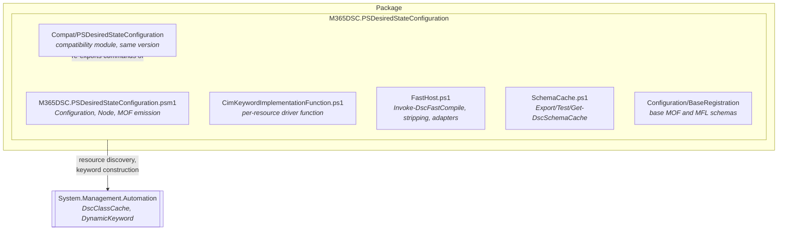
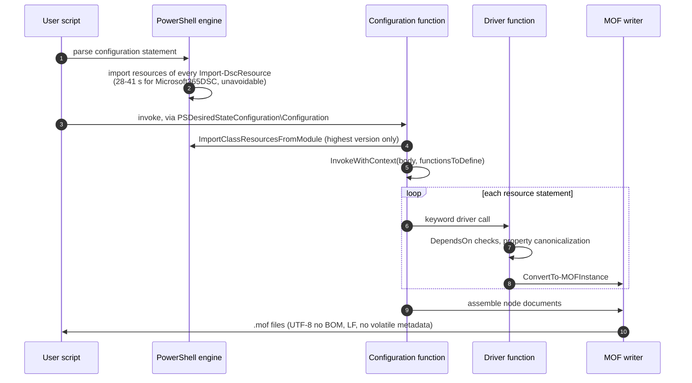
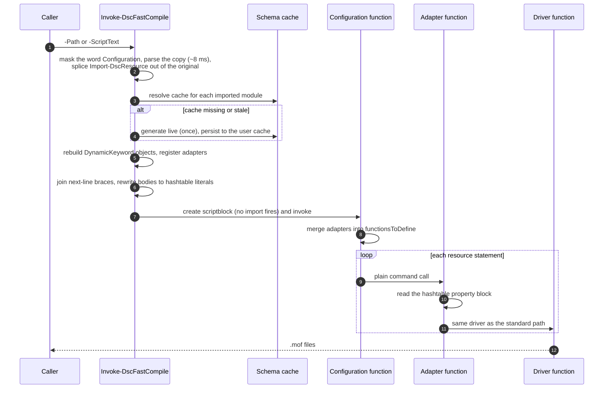
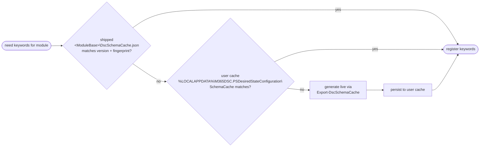
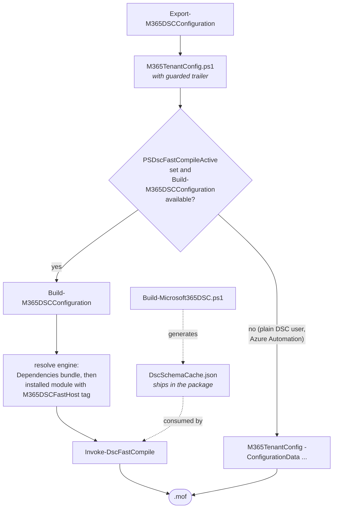

# Architecture

How this module compiles DSC configurations, why the fast host exists, and how to use it.

Companion documents: [FastHostContract.md](FastHostContract.md) for the exact command surface and cache
format, [../README.md](../README.md) for installation and measured numbers.

## The problem

Compiling a 30-50 line configuration that imports Microsoft365DSC (>530 class-based resources) took
40-150 seconds. Almost none of that is MOF generation. The cost is DSC resource discovery, and it was
paid several times per compile:

| Cost | Why it happened |
|---|---|
| Parse-time import | The engine imports every resource of every `Import-DscResource` module while parsing the configuration statement. Unavoidable in the standard path. |
| Runtime import | The `Configuration` function imported the same modules again. |
| Per extra version | The import loop ran once for every installed version of a resource module, not just the requested one. |

Discovery itself is not slow: calling the engine's own
`[Microsoft.PowerShell.DesiredStateConfiguration.Internal.DscClassCache]::ImportClassResourcesFromModule`
directly costs about 6 seconds for all 531 Microsoft365DSC resources. The module was simply paying it
repeatedly.

## Module layout



The engine is plain PowerShell script on both Windows PowerShell 5.1 and PowerShell 7; there is no
binary component. All resource discovery is delegated to the compiled `DscClassCache` that ships inside
`System.Management.Automation` on both editions.

### Why the compatibility module exists

The parser rewrites `Configuration Foo { ... }` into a function whose body the engine generates
(`ConfigurationDefinitionAst.GenerateSetItemPipelineAst`, a string literal inside
`System.Management.Automation`). That generated body always starts with

```powershell
Import-Module Microsoft.PowerShell.Management -Verbose:$false
Import-Module PSDesiredStateConfiguration -Verbose:$false
$toBody = @{}+$PSBoundParameters
...
```

and ends with a call to the module-qualified name `PSDesiredStateConfiguration\Configuration`. Both the
import and the qualified call resolve by module name at invocation time. The first module who owns that
name owns the compile.

Claiming the name with a global function named `PSDesiredStateConfiguration\Configuration` covers the
qualified call, but not the import in front of it. That import still resolves through `PSModulePath` and
loads the inbox 1.1 or gallery 2.x module, whose exports then shadow this engine's `Configuration`,
`Get-DscResource` etc. functions for the rest of the session. So the package also ships a small module
that carries the legacy name and forwards to the engine. It reuses an already-loaded engine instance
rather than importing a second one, because two instances would hold separate keyword and fast host
state and configurations would run against the wrong one.

## Standard compile path

Plain `.\config.ps1` execution. Behavior is unchanged from upstream apart from caching and determinism.



### Keyword state per compile

Two engine behaviors shape this design:

- `LoadDefaultCimKeywords` **removes** previously imported module classes from the engine cache, so the
  warm path must not call it. It replays a snapshot of the default function entries instead.
- Every compile ends with `[DynamicKeyword]::Reset()`. The parser keyword table is therefore rebuilt on
  the warm path from a snapshot taken before the reset.

## Fast compile path

`Invoke-DscFastCompile` avoids the parse-time import altogether. It never lets the engine see an
`Import-DscResource` statement.



### Stripping without parsing

Any full parse of the configuration text fires the engine import: `Parser.ParseInput`,
`Parser.ParseFile`, `[scriptblock]::Create`, and even the legacy `PSParser.Tokenize` (measured at 23
seconds for a Microsoft365DSC configuration). The workaround is length-preserving masking:

1. Replace the word `Configuration` with `C0nfiguration` in a **copy** of the text. No configuration
   statement is recognized, so no import runs.
2. `Parser.ParseInput` the masked copy (about 8 ms) and collect the `Import-DscResource` command ASTs.
3. Because the mask preserves offsets, apply those extents to the **original** text to remove the
   statements and capture their `-ModuleName`, `-Name` and `-ModuleVersion` arguments.

### Why resource statements still execute

With the imports stripped, resource keywords are unknown to the parser, so `AADGroup "Name" { ... }`
compiles to an ordinary command call: the resource name, an instance name, and a scriptblock. The fast
host defines a function for each cached keyword, injected through the same `functionsToDefine`
dictionary the engine uses for real keywords. The adapter receives the property block as a hashtable
evaluated in the caller's scope, so `$ConfigurationData`, `$AllNodes`, `$Node` and user variables
resolve normally, then calls the same driver function as the standard path. Everything downstream,
including `DependsOn`, embedded instances, credentials and conflict detection, is shared code.

Two wrinkles, both handled by the same masked-AST technique:

- A resource whose opening brace is on the **next** line (the Microsoft365DSC export style) would
  parse as two unrelated statements. `Merge-FastHostResourceStatements` joins them first.
- DSC registers resource keywords with `BodyMode = Hashtable`, so the real parser reads a body as a
  hashtable and a property may be named `User`, `Settings`, `Script` and so on. Left as a scriptblock
  those names are still live built-in keywords and the assignment is a syntax error, so
  `Convert-FastHostBodyToHashtable` rewrites every keyword body to a hashtable literal afterwards.

MOF validation (`ValidateInstanceText`) needs live CIM classes, which the cache-driven path does not
register, so it is skipped unless `-ValidateMof` is passed.

### Schema cache



The cache is a JSON serialization of the `DynamicKeyword` definitions: keyword name, implementing
module, name and body modes, and every property's type constraint, key and mandatory flags, allowed
values and value map. Embedded complex types are ordinary no-name keywords in the same flat list. Value
maps are stored as arrays of key/value pairs because DSC permits empty-string keys, which JSON object
properties cannot represent portably. The format is versioned; consumers reject anything newer than
they know.

### Fallback

The fast host degrades to standard compilation, with a warning, when it cannot guarantee equivalence:

| Trigger | Reason |
|---|---|
| `Import-DscResource` with non-constant arguments | Module set cannot be determined without executing the script. |
| `-Name` without `-ModuleName` | Would require scanning every installed module. |
| Module contains `*.schema.mof` or `*.schema.psm1` | Script-based and composite resources need the engine's own import. |
| No usable schema cache | Nothing to register keywords from. |

`-NoFallback` turns these into terminating errors instead, which is what continuous integration should
use.

## Deterministic output

The same configuration compiles to identical bytes on every run, machine, user and edition:

- No `/*@TargetNode ... @GeneratedBy ... */` banner and no `Author`, `GenerationDate` or
  `GenerationHost` fields.
- LF line endings throughout the assembled document.
- Files written through a single helper as UTF-8 without BOM. Output redirection previously produced
  UTF-16 on Windows PowerShell 5.1 and UTF-8 on PowerShell 7 for the same document.

Property **order** within an instance still differs between editions because it follows hashtable
enumeration. `tools/benchmarks/Compare-DscMofOutput.ps1` normalizes ordering, instance aliases and
volatile fields, and is the right tool for comparing output across paths or editions.

## Using the fast compile architecture

### Through Microsoft365DSC tooling



```powershell
Build-M365DSCConfiguration -Path .\M365TenantConfig.ps1
Build-M365DSCConfiguration -Path .\M365TenantConfig.ps1 -Engine Standard   # force the standard path
Test-M365DSCFastCompileAvailable                                           # is a capable engine present?
```

The exported script's trailer calls the wrapper when it is available and falls back to a plain
configuration invocation otherwise, so plain DSC users and Azure Automation are unaffected.
`$Global:PSDscFastCompileActive` guards against recursion when the fast host re-executes the script.

### Directly

```powershell
$engine = 'C:\path\to\M365DSC.PSDesiredStateConfiguration'
Import-Module (Join-Path $engine 'M365DSC.PSDesiredStateConfiguration.psd1')

Export-DscSchemaCache -ModuleName Microsoft365DSC        # one-time, ships with the module if built
Invoke-DscFastCompile -Path .\M365TenantConfig.ps1
```

### In continuous integration

```powershell
Test-DscSchemaCache -ModulePath $moduleBase -CachePath $cacheJson -Detailed   # drift gate
Invoke-DscFastCompile -Path $config -NoFallback                               # fail instead of degrading
.\tools\benchmarks\Compare-DscMofOutput.ps1 -ReferencePath $a -CandidatePath $b
```

Regenerate the shipped cache whenever the resource module changes, and generate it **after** any step
that adds or trims files in the module tree, since those files feed the fingerprint.

## Troubleshooting

| Symptom | Cause |
| --- | --- |
| Compiles are slow and MOFs carry `GenerationDate` | Compilation went through the inbox or gallery module. Check `(Get-Module PSDesiredStateConfiguration).Path` - it must point at the engine's `Compat` folder. It will not when the engine was never imported, or when its `Compat` folder was dropped from `PSModulePath` after the import. |
| "Falling back to standard compilation" | See the fallback table above; the warning names the reason. |
| A resource property change is ignored | Stale schema cache. Regenerate with `Export-DscSchemaCache`, or use `-Force`. |
| `Undefined DSC resource` inside the fast host | The configuration used a form the stripper does not support; expect the fallback warning first. Report the configuration shape. |
