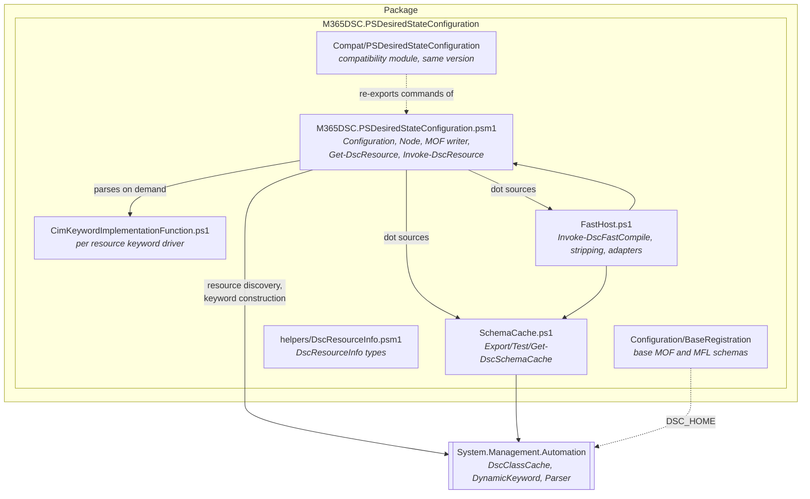
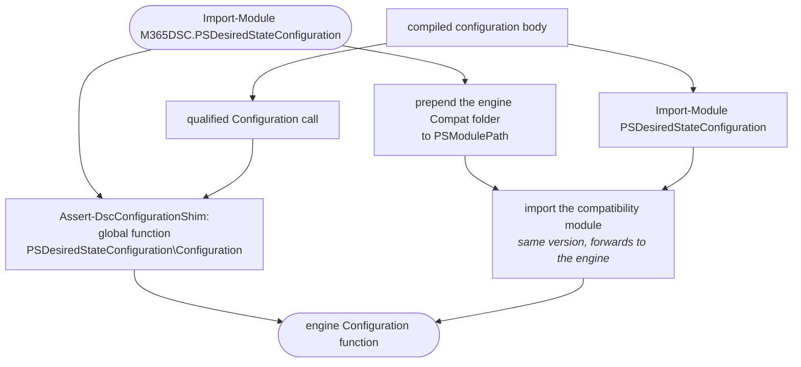
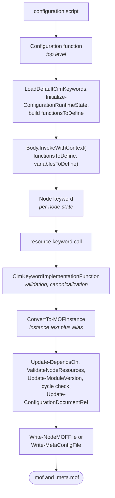
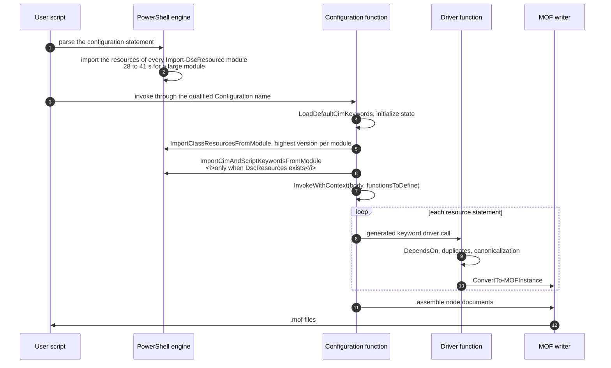
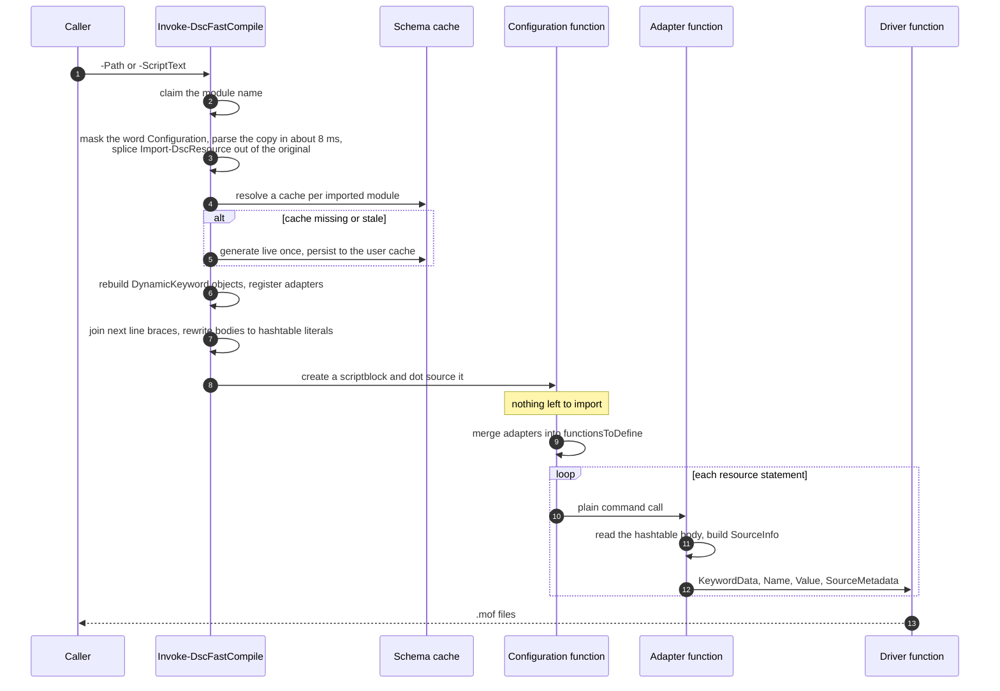
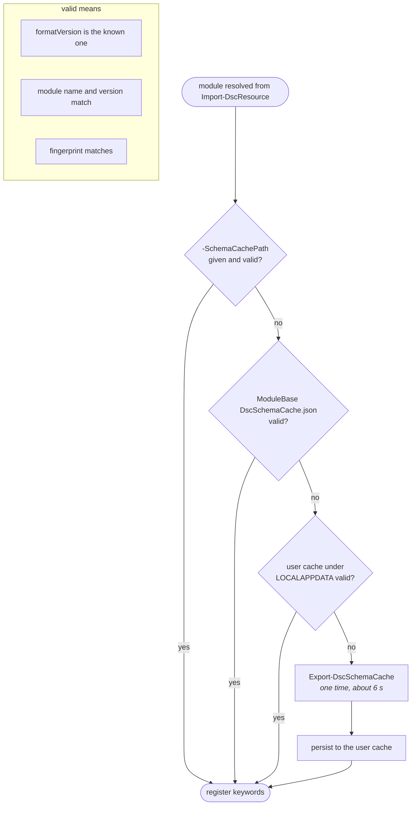

# Architecture

## Table of contents

1. [Introduction](#introduction)
2. [Module layout](#module-layout)
3. [The module name claim](#the-module-name-claim)
4. [The compile pipeline](#the-compile-pipeline)

    1. [Where keywords come from](#where-keywords-come-from)
    2. [Configuration runtime state](#configuration-runtime-state)

5. [Standard compile path](#standard-compile-path)
6. [Fast compile path](#fast-compile-path)

    1. [Masking instead of parsing](#masking-instead-of-parsing)
    2. [Stripping the imports](#stripping-the-imports)
    3. [Joining next line braces](#joining-next-line-braces)
    4. [Rewriting bodies to hashtable literals](#rewriting-bodies-to-hashtable-literals)
    5. [Adapters](#adapters)
    6. [Fallback](#fallback)

7. [Schema cache](#schema-cache)

    1. [Generation](#generation)
    2. [Resolution and validation](#resolution-and-validation)
    3. [Format](#format)

8. [The keyword driver](#the-keyword-driver)
9. [MOF instance generation](#mof-instance-generation)

    1. [Value conversion](#value-conversion)
    2. [Credentials](#credentials)

10. [Nodes and document assembly](#nodes-and-document-assembly)
11. [Deterministic output](#deterministic-output)
12. [The other exported commands](#the-other-exported-commands)
13. [Editions](#editions)
14. [Repository layout](#repository-layout)
15. [What to take into account](#what-to-take-into-account)

## Introduction

This module is a DSC configuration compiler. It owns the `Configuration` and `Node` keywords, works
out what every resource keyword in a script means, validates and canonicalizes the values a user
wrote, and turns all of it into MOF documents. It is a fork of the pure script
`PSDesiredStateConfiguration` v2.0.7 lineage, aimed squarely at resource modules with several hundred
class based resources, where the stock compiler spends almost all of its time on one thing.

That one thing is resource discovery. Before a parser will accept `AADGroup 'MyGroup' { ... }` as a
resource statement, somebody has to import the module that defines `AADGroup`, and for a module of
that size the import costs tens of seconds. The stock compiler pays it while parsing and then pays it
again at runtime. Producing the MOF text afterwards is milliseconds of work by comparison.

Two additions follow from that. The **fast compile host** (`Invoke-DscFastCompile`) compiles a
configuration without letting the PowerShell engine import the resource module at all, reading the
keyword definitions out of a persistent JSON cache instead. And **deterministic MOF output** makes the
result of both paths comparable byte for byte on Windows PowerShell 5.1 and PowerShell 7 alike, which
is the evidence that the shortcut did not change anything.

This document explains how the module is built, which component owns which step of a compile, and
where the two paths diverge. It is written for somebody who has to reason about or change the module.
The command surface, the cache format and the consumer contract live in
[FastHostContract.md](FastHostContract.md).

## Module layout



The root module dot sources `SchemaCache.ps1` and `FastHost.ps1` at import time, so all three files
share one module scope and one set of script variables. Any of them can read the keyword table the
fast host built or the state a compile is accumulating, without passing anything around.

`CimKeywordImplementationFunction.ps1` is the exception. It is never dot sourced. The engine parses it
from file on first use and caches the resulting scriptblock, which keeps errors raised inside the
driver pointing at a real file and a real line number instead of at a string literal somewhere in a
module.

`$env:DSC_HOME` is pointed at the module's `Configuration` folder during import. That folder holds
the base registration schemas, `BaseResource.schema.mof` and the meta configuration MOF and MFL
files, which `DscClassCache` reads whenever it loads the default keywords.

Everything the manifest exports:

| Command | Purpose |
| --- | --- |
| `Configuration` | The configuration keyword implementation, the entry point of every compile |
| `Invoke-DscFastCompile` | Cache driven compilation of a configuration script |
| `Export-DscSchemaCache` | One time discovery of a module's keywords into a JSON cache |
| `Test-DscSchemaCache` | Validation of a cache against a module, for CI drift gating |
| `Get-DscResource` | Resource discovery and syntax rendering |
| `Invoke-DscResource` | Direct `Get`, `Set` or `Test` invocation of a single resource |
| `New-DscChecksum` | SHA256 sidecar files for compiled documents |

`Node` is deliberately absent from that list. It never needs to be callable from a session, so it is
injected into each configuration body under the module qualified name
`PSDesiredStateConfiguration\node`, which is the name the parser generates for it.

None of this is compiled code. Resource discovery is delegated to `DscClassCache`, which already
ships inside `System.Management.Automation` on both editions, so one script implementation covers
both.

## The module name claim

**Important.** The module that compiles a configuration is not the module you imported. The parser
rewrites `Configuration Foo { ... }` into a function whose body the engine generates, and that
generated body opens with `Import-Module PSDesiredStateConfiguration` and closes with a call to the
module qualified name `PSDesiredStateConfiguration\Configuration`. Both are resolved by module name at
the moment the configuration runs, so whoever holds that name at that moment owns the compile.

The package therefore claims the name twice, because those two lines resolve through different
mechanisms.



`Assert-DscConfigurationShim` covers the qualified call by assigning the engine's own `Configuration`
function to the global function name `PSDesiredStateConfiguration\Configuration`. It has to be
re-asserted before every fast host invocation and after every parse, because parsing a configuration
statement makes the engine load the inbox module by file path, which quietly takes the name back.

The prologue import is a different problem, since it goes through `PSModulePath` rather than through
a function name. Importing the engine therefore also imports the bundled compatibility module and
prepends its `Compat` folder to the path. That module carries the legacy name and the same version,
and it re-exports the engine's seven commands by lifting their scriptblocks straight out of the
engine's module scope, so a forwarded command still sees the engine's script variables rather than
running in a scope of its own.

**Important.** The compatibility module never imports a second engine. It reuses one that is already
loaded, and during the engine's own import, when the engine is not yet visible to `Get-Module`, the
engine hands itself over through the `$global:M365DscEngineHandoff` variable. A second instance would
bring its own keyword table and its own fast host state, and configurations would compile against
whichever copy won the name claim.

`Remove-Module` undoes the whole arrangement. The global function is dropped, the compatibility
module is removed, and only the `PSModulePath` entry the engine itself added is taken off again, so
whatever the session put on the path afterwards survives.

## The compile pipeline

Every compile, on either path, runs the same spine.



The top level invocation is the one that owns state. Nested configurations, composite resources and
`Node` statements re-enter the same function but skip the initialization and the file writing, which
is what the `topLevel` flag and the configuration nesting stack keep track of.

`functionsToDefine` deserves a closer look, because it is how the whole design hangs together. It is
a dictionary of everything the configuration body is allowed to call, filled with the default CIM
keywords, the utility functions the driver needs (`ConvertTo-MOFInstance`, `Get-MofInstanceText`, the
node resource tables, the error counter, conflict detection), the `Node` keyword, one driver per
resource keyword, and on the fast path the adapters. `ScriptBlock.InvokeWithContext` then defines all
of them in the body scope together with `variablesToDefine`, which supplies `ConfigurationData`,
`AllNodes`, `MyTypeName`, `IsMetaConfig` and the configuration's own parameters. Because none of it
is global, cleanup after a compile costs nothing.

### Where keywords come from

This is the only real difference between the two paths. Everything else in the table follows from it.

| | Standard path | Fast compile path |
| --- | --- | --- |
| Keyword source | Live import of the resource module through `DscClassCache` | JSON schema cache holding the same keyword definitions |
| Parse time cost | The parser sees `Import-DscResource` and imports the module while parsing | The statement is removed before the text is parsed for real |
| Runtime cost | The `Configuration` function imports the same modules a second time | No import at all |
| Resource statement | A real `DynamicKeyword` the parser recognizes | An ordinary command call routed to an adapter |
| Property block | The parser reads it as a hashtable, because the keyword declares `BodyMode = Hashtable` | Rewritten to a hashtable literal in the text |
| CIM classes | Registered, so `ValidateInstanceText` can run | Not registered, so MOF validation is skipped by default |
| Script based and composite resources | Supported | Fall back to the standard path |

For a module with more than 530 class based resources the live import is the compile: 28 to 41
seconds at parse time, then the same work again at runtime. Discovery itself is not slow, roughly 6
seconds through `DscClassCache::ImportClassResourcesFromModule`. The standard path is simply asking
for it over and over.

### Configuration runtime state

`Initialize-ConfigurationRuntimeState` creates the tables a compile writes into. Most of them exist
twice, once keyed by node name for named nodes and once for the unnamed node that collects resources
declared outside any `Node` statement.

| State | Holds |
| --- | --- |
| `NodeResources` | Resource id to its `DependsOn` prerequisites, used for reference and cycle validation |
| `NodeKeys` | Key property values per keyword, used for conflict detection |
| `NodeTypeRefCount` | Per type instance counter that generates the MOF aliases |
| `NodeInstanceAliases` | Alias to MOF instance text, the material the document is assembled from |
| `NodeResourceIdAliases` | Resource id to alias, used when `DependsOn` is rewritten into alias references |
| `NodeManager`, `NodeResourceSource`, `NodeExclusiveResources` | Partial configuration and LCM bookkeeping |
| `ExplicitlyImportedModules` | Module versions named by `Import-DscResource`, used when the document records module versions |
| `PSConfigurationErrors` | Error counter; a non zero count at the end fails the compile instead of writing files |

All of it lives in script scope, which means a compile is not reentrant across runspaces. The top
level `finally` block resets the state and calls `[DynamicKeyword]::Reset()`, and that is what lets a
single session compile one configuration after another without dragging the previous run's keywords
along.

`ConfigurationData` is checked before any of this matters. It must contain `AllNodes`, `AllNodes` has
to be an array of hashtables, every entry needs a `NodeName`, node names must be unique, and the `*`
entry is merged into every other node as a set of defaults.

## Standard compile path

Plain execution of a configuration script.



Two details of the import loop are worth knowing. Modules named by `Import-DscResource` are resolved
with `Get-Module -ListAvailable -FullyQualifiedName` and then reduced to **one module info per name**,
either the highest version or the requested one, so a machine with five versions installed does not
import five times. And the CIM and script keyword import only runs when the module actually has a
`DscResources` folder, which is how script based and composite resources come into scope. A composite
resource is imported as a module in its own right and reloaded when its `*.schema.psm1` changed since
the last compile in the session.

## Fast compile path

`Invoke-DscFastCompile` never lets the engine see an `Import-DscResource` statement.



Before any of that can run, the text has to be rewritten, and every rewrite is steered by an AST
taken from a masked copy rather than from the text itself. One parse serves every edit, and
`ConvertTo-FastHostCompileText` applies all of them to the original text in a single pass.


### Masking instead of parsing

**Important.** There is no way to look at a configuration script without triggering the import.
`Parser.ParseInput`, `Parser.ParseFile`, `[scriptblock]::Create` and even the legacy
`PSParser.Tokenize` all fire it, the last one measured at 23 seconds for a large configuration. That
is PowerShell behaving as designed on both editions, not something a parameter turns off. A tool that
wants the AST of a configuration first has to make the text stop looking like one.

Masking does that without moving a single character. Every occurrence of the word `Configuration`
becomes `C0nfiguration` in a **copy** of the text, the parser stops recognizing a configuration
statement, no import runs, and the parse costs about 8 milliseconds. The replacement has the same
length as the original, which is the entire trick, because it means every extent offset the AST
reports for the masked copy points at exactly the same character in the untouched original.

### Stripping the imports

`Get-StrippedConfigurationText` reads the declared configuration names and every `Import-DscResource`
command off that masked AST. Each import contributes its `-Name`, `-ModuleName` and `-ModuleVersion`,
positionally or named, and only constant values count, meaning string literals and array literals of
string literals. A computed module name would have to be executed before it is known, and executing
the script is exactly what this path avoids, so such a script falls back instead.

The import statements are then cut out of the original text by extent, leaving a script with no DSC
specific syntax in it at all.

### Joining next line braces

With the imports gone the parser no longer knows the keywords, and the common export style stops
being a single statement:

```powershell
AADGroup 'MyGroup'
{
    DisplayName = 'My Group'
}
```

What the parser sees is a command call followed by an unrelated scriptblock, and the resource is
lost. `Merge-FastHostResourceStatements` finds those pairs in the masked AST and splices the gap
between them down to a single space, which makes the block the last argument of the command again.
Two shapes qualify. One is the resource statement `KeywordName [InstanceName]`. The other is a nested
CIM instance inside a resource body, written as `PropertyName = KeywordName`, which despite the equals
sign is not an assignment but a single command whose three elements are the property name, a literal
`=` and the keyword.

### Rewriting bodies to hashtable literals

**Important.** DSC registers resource keywords with `BodyMode = Hashtable`, so on the standard path
the parser reads a resource body as a hashtable and a property is free to be called `User`,
`Settings` or `Script`. Leave that same body as a scriptblock and those names are live built in
keywords again, which turns an ordinary property assignment into a syntax error.

`Convert-FastHostBodyToHashtable` closes the gap by inserting an `@` in front of every keyword body,
turning `{ ... }` into `@{ ... }` and adding a separator where the source had none. What comes out is
a script the parser can take at face value, in which every resource is a command call whose last
argument happens to be a hashtable literal.

### Adapters

`Register-DscSchemaCache` keeps the cache as text lines plus the keyword index and registers the
adapters for every name in the index. `Get-FastHostKeyword` deserializes a keyword line into a real
`DynamicKeyword` the first time a compile asks for it and keeps it in a case insensitive dictionary,
so a compile pays for the keywords it uses and not for the whole module. Each keyword gets the same shared adapter scriptblock,
registered twice, under the bare name and under the module qualified name, because a configuration
body may call it either way. When the fast host is active the `Configuration` function merges those
adapters plus four accessors (`Get-FastHostKeyword`, `Get-FastHostBodyScriptBlock`,
`Get-FastHostScriptPath`, `Get-CimKeywordImplementationFunction`) into `functionsToDefine`, the very
dictionary real keywords would have gone into.

The adapter reads the keyword name off `$MyInvocation.InvocationName`, takes the last argument as the
property hashtable and the first as the instance name when `NameMode` is `NameRequired`, builds the
`SourceInfo` string and calls the same driver the standard path uses. The property block arrives as a
hashtable PowerShell has already evaluated in the caller's scope, which is why `$ConfigurationData`,
`$AllNodes`, `$Node`, script parameters and user variables behave exactly as they do on the standard
path.

A scriptblock built from text carries no file name, which would leave every `SourceInfo` pointing
nowhere, so the real script path is stored separately and handed to the adapter instead.

**Important.** Cached keywords live only in the fast host's dictionary. They never enter the parser
keyword table and no CIM classes are registered with the MI layer. Two consequences follow.
`ConvertTo-MOFInstance` has to consult that dictionary before falling back to
`[DynamicKeyword]::GetKeyword()`, and `Test-MofInstanceText` has nothing to validate against, so it
returns immediately unless `-ValidateMof` was passed.

### Fallback

The fast host would rather be slow than be wrong. Whenever it cannot guarantee that its result equals
what the standard path would have produced, it degrades to standard compilation and warns with the
reason.

| Trigger | Reason |
| --- | --- |
| `Import-DscResource` with non constant arguments | The module set cannot be determined without executing the script |
| `-Name` without `-ModuleName` | Would require scanning every installed module |
| The named module is not installed, or not in the requested version | Nothing to resolve a cache against |
| The module contains `*.schema.psm1` under `DscResources` | Composite resources need the engine's own import |
| No usable schema cache and none can be generated | Nothing to register keywords from |

`-NoFallback` turns each of these into a terminating error. Continuous integration should use it,
because a stale cache that quietly degrades into a slow compile still passes, and nobody looks at a
passing job.

## Schema cache

### Generation

`Export-DscSchemaCache` resets the keyword state, loads the default keywords and remembers their
names, imports the module's class based resources once through
`DscClassCache::ImportClassResourcesFromModule`, reads every `DscResources\<Name>\<Name>.schema.mof`
through `ImportCimKeywordsFromModule`, and serializes every cached keyword that was not already a
default. It resets the keyword state afterwards as well, so generating a cache does not
leave the session holding the module's classes.

Default output is `<ModuleBase>\DscSchemaCache.json`. The summary it returns carries the module name
and version, the resource and keyword counts and the fingerprint, which gives a build script
something concrete to assert against the module manifest.

### Resolution and validation



The user cache lives at
`%LOCALAPPDATA%\M365DSC.PSDesiredStateConfiguration\SchemaCache\<Name>_<Version>_<fingerprint>.json`.

A cache has to earn its place before any of its keywords are used. Its format version has to be the
one the reader knows, its module name and version have to match, and so does its fingerprint. That
fingerprint is `fileCount:totalBytes:hash` over the sorted relative paths and sizes of every `*.psm1`,
`*.psd1` and `*.mof` file below the module base. It carries no write times, which is what lets the
cache shipped inside a package stay valid after `Install-Module` copied the files. When the file set
grew, the fingerprint is recomputed over the files the cache recorded, so an unrelated file placed
next to the module does not invalidate it. A file edited to the same size slips through, which is why
the build regenerates the cache and why `Test-DscSchemaCache -Detailed` re-hashes every recorded file
in a CI drift gate.

The module named by `Import-DscResource` is located with a scan of `PSModulePath` for the manifest,
not with `Get-Module -ListAvailable`, which analyzes every nested module and costs seconds for a
large resource module. Registration is remembered per module and version for the life of the session,
so a second compile in the same process reuses the keyword table and touches no JSON.

### Format

The cache is a JSON serialization of the very `DynamicKeyword` definitions a live import would have
produced. It records the keyword name, the resource name, the implementing module and version, the
name and body modes, the direct call and meta statement flags, and for every property its type
constraint, its key and mandatory flags, its attributes, its allowed values and its value map.
Embedded complex types sit in the same flat list as ordinary no name keywords.

Value maps are arrays of key and value pairs rather than JSON objects, because DSC permits an empty
string as a map key and no JSON object can carry that portably. The format is versioned and consumers
must reject anything newer than they know. The full schema is in
[FastHostContract.md](FastHostContract.md).

## The keyword driver

`CimKeywordImplementationFunction.ps1` is the single driver both paths use. It is the function DSC
generates a call to for every resource statement, and it carries all the validation that is not the
parser's job. Per resource instance it:

1. Builds the resource id `[Keyword]InstanceName`, extended with the complex resource qualifier when
   the statement sits inside a composite resource, and records `SourceInfo`, `ModuleName` and
   `ModuleVersion` as meta properties.
2. Validates every `DependsOn` reference against the `[Type]Name` pattern, rewrites nested
   references, merges them with the `DependsOn` of an enclosing composite resource, and registers the
   result in the node resource table. `DependsOn` is then removed from the property set, because it
   is rewritten into alias references at the end of the compile.
3. Rejects a duplicate resource id within the same node.
4. Merges `PsDscRunAsCredential` from the enclosing configuration and errors when both sides set it.
5. Copies every user supplied value into a fresh hashtable with canonically cased property names,
   checking allowed values, ranges and mandatory properties, and translating value map entries to
   their MOF representation.
6. Accumulates the key property values and runs conflict detection across instances that share them.
7. Applies the meta configuration special cases (`OMI_ConfigurationDocument`, partial configurations,
   download managers, the single value `DebugMode` rule) when the configuration is an LCM
   configuration.
8. Calls `ConvertTo-MOFInstance` and returns the alias it produced.

Problems are reported through `Write-Error` plus `Update-ConfigurationErrorCount` rather than by
throwing, so one compile tells you about every broken resource instead of only the first one. The
error count is inspected once, at the end of the top level configuration, and a non zero count means
no files are written at all.

## MOF instance generation

`ConvertTo-MOFInstance` turns a canonicalized property hashtable into MOF instance text and hands back
an alias. That alias is `$<ResourceName><n>ref`, with `n` coming from the per node per type reference
counter, and the text goes into the node's alias table rather than to disk, because the document
cannot be assembled until every instance is known.

Keyword lookup goes through the fast host dictionary first and `[DynamicKeyword]::GetKeyword()`
second, which is what lets one function serve both paths. The keyword's property type constraint then
decides how each value is rendered, and the mapping from MOF type names to .NET types is memoized in
a script level map, since the same handful of constraints repeats across hundreds of resources.

### Value conversion

`stringify` renders a single value:

| Input | Output |
| --- | --- |
| Array | Brace enclosed, comma separated list, elements rendered with the target type |
| `PSCredential` | A nested `MSFT_Credential` instance with an encrypted password |
| Hashtable | A sequence of `MSFT_KeyValuePair` instances |
| ScriptBlock | The script text with `$using:` variables rewritten to plain variables, preceded by assignments carrying the serialized local values |
| Everything else | The value cast to the constraint's target type and rendered directly |

Nested keyword calls inside a resource body produce their own instances and return aliases, which is
how embedded CIM instances find their way into the document. A `$null` value for a property whose
constraint is `Instance` is rejected outright, since an embedded instance cannot be null.

### Credentials

A `PSCredential` becomes an `MSFT_Credential` instance whose password goes through
`Get-EncryptedPassword` first. That function looks up the node data for the current node, or the
`localhost` entry in `AllNodes` for resources declared outside a node statement, and encrypts with
`Protect-CmsMessage` when the node names a `CertificateID` (a thumbprint) or a `CertificateFile` (a
public key file). The encrypted bytes are reversed afterwards for the unmanaged decryption side.

Without a certificate the compile insists on `PSDscAllowPlainTextPassword` on the node, and a domain
user in the credential additionally needs `PSDscAllowDomainUser`. Both are node data flags, and the
compile records which nodes used domain credentials so the document can be flagged accordingly.

## Nodes and document assembly

The `Node` keyword receives the node names and the body scriptblock. It pushes the enclosing node
onto a stack, builds a map from node name to the matching `AllNodes` entry, invents a minimal entry
for any node the data does not describe, and then, per node, points the script level state tables at
that node's dictionaries before invoking the body. Nested `Node` statements are filtered against the
enclosing node, so an inner node only runs for the node it belongs to.

Once the body of the top level configuration has run, the engine finishes each node in order.
`Update-DependsOn` rewrites the recorded resource ids into instance aliases. `ValidateNodeResources`
and `ValidateNoNameNodeResources` confirm that every referenced resource exists, and
`ValidateNoCircleInNodeResources` runs a strongly connected component search over the dependency
graph. `Update-ModuleVersion` fills in the module version each instance records,
`Update-ConfigurationDocumentRef` links the instances to the configuration document, and
`Write-NodeMOFFile`, or `Write-MetaConfigFile` for an LCM configuration, assembles it.

Assembly separates the meta configuration instances from the resource instances and appends the
`OMI_ConfigurationDocument` instance, taken from the node, from the configuration default, or built
fresh with the minimum compatible version the document needs. `Test-MofInstanceText` runs before the
write. A document that fails it is written to `<node>.mof.error` instead, and a compile that recorded
any error writes nothing.

## Deterministic output

The same configuration compiles to identical bytes on every run, machine, user and edition, and three
decisions make that true.

- No generated by banner, and no `Author`, `GenerationDate` or `GenerationHost` fields in the
  configuration document.
- LF line endings inside the document, because the instance text is assembled with `\n`.
- Every file written through one helper, `Write-MofDocumentFile`, as UTF-8 without a byte order mark.
  Output redirection would produce UTF-16 on Windows PowerShell 5.1 and UTF-8 on PowerShell 7 for the
  same document.

Property **order** within an instance is the one thing that still moves, since it follows hashtable
enumeration and can differ between editions. `tools/benchmarks/Compare-DscMofOutput.ps1` normalizes
ordering, instance aliases, whitespace outside strings and the volatile document fields, which makes
it the right tool for comparing output across paths or editions.

## The other exported commands

**`Get-DscResource`** loads the default keywords, works out which modules to look at, either the ones
named by `-Module` or every module on `PSModulePath` that has a `DscResources` folder or a
`DscResourcesToExport` entry in its manifest, and turns the resulting keywords and composite resource
files into `DscResourceInfo` objects. Those types come from `helpers/DscResourceInfo.psm1`, which
compiles a small C# source at import time. `-Syntax` renders the keyword as a usage block instead of
returning objects.

**`Invoke-DscResource`** runs a single resource method outside a compile. It resolves the resource
through `Get-DscResource` and refuses `PsDscRunAsCredential` as well as anything not implemented in
PowerShell, then dispatches on the implementation detail. A class based resource is instantiated in a
fresh runspace created from `InitialSessionState::CreateDefault2` with `using module <path>`, its
properties are assigned from the property hashtable and the method is called. A script based resource
is imported and its `Get-`, `Set-` or `Test-TargetResource` function is splatted. `Set` returns a
reboot flag derived from `$global:DSCMachineStatus`, `Test` returns an `InDesiredState` flag, and
`Get` returns whatever the resource itself produced.

**`New-DscChecksum`** walks the given paths for `.mof` and `.zip` files and writes a
`<file>.checksum` sidecar containing the SHA256 hash, either next to the file or under `-OutPath`.

## Editions

The module targets Windows PowerShell 5.1 and PowerShell 7 from a single manifest
(`CompatiblePSEditions = Desktop, Core`). Both editions expose the same `DscClassCache` and
`DynamicKeyword` types inside `System.Management.Automation`, which is what makes one script
implementation possible in the first place.

Only two things really differ between them and the module absorbs both. One is which module would
otherwise claim the `PSDesiredStateConfiguration` name, the inbox 1.1 module on Windows PowerShell
and the gallery 2.x module on PowerShell 7. The other is the default file encoding, which is why
every document goes through a single writer rather than through redirection.

## Repository layout

| Path | Contents |
| --- | --- |
| `M365DSC.PSDesiredStateConfiguration/` | The module, published straight from this folder |
| `M365DSC.PSDesiredStateConfiguration/Compat/` | The compatibility module that claims the legacy name |
| `docs/` | This document and the fast host contract |
| `test/` | Pester suites plus `TestModules`, small resource modules covering class based, script based, composite, credential, ambiguous name and state scenarios |
| `tools/benchmarks/` | Compile benchmark, MOF comparison and benchmark configuration generator, with a checked in `baseline.json` |
| `Utilities/Build.ps1` | Validation and test entry point |

`Build.ps1` compiles nothing, because the module is pure script and is published from its folder as
it stands. What it does is keep that folder publishable. It syncs the bundled compatibility module to
the engine version, validates both manifests, verifies that the module imports and exports what the
manifest promises, and with `-Test` runs the Pester suites on both editions.

`Invoke-DscCompileBenchmark.ps1` measures compile time across editions, compile paths (the built in
module, the fork's standard path, the fork's fast host) and cache states. Every sample runs in a fresh
child process, one warm up run per cell is discarded and the median of the rest is reported, which is
what makes the numbers in this document worth quoting.

## What to take into account

**The cache is the contract on the fast path.** A property that exists in the resource source but not
in the cache does not exist as far as compilation is concerned. The fingerprint check is the only
thing keeping the two honest, and a cache has to be regenerated after any step that adds, trims or
resizes files in the module tree, because those files feed the fingerprint.

**Never call `LoadDefaultCimKeywords` to warm a cache.** It belongs in exactly one place, the top
level compile that populates `functionsToDefine`. Calling it to inspect keyword state clears
previously imported module classes out of the engine cache and takes the compile down with it.

**Every compile ends with `[DynamicKeyword]::Reset()`.** Anything that needs keyword state to outlive
a compile has to keep it in the module's own tables, which is exactly what the fast host does.

**Validation is traded away deliberately.** MOF validation needs the live CIM classes the cache driven
path never registers. `-ValidateMof` brings it back for a diagnostic run, at the price of the import
the fast path exists to avoid.

**One engine instance per session.** The compatibility module reuses a loaded engine and never
imports a second one. Import the engine from two locations and you get two keyword tables and two
sets of fast host state, with the compile running against whichever one holds the name.

**Determinism is a feature to preserve.** Reintroduce a volatile document field, a banner or a
platform dependent encoding and MOF output stops comparing byte for byte between the two paths and
between editions, which removes the main evidence that the fast path is still equivalent.
